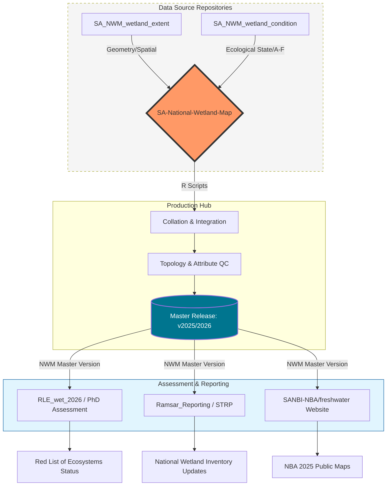

# SA-National-Wetland-Map-project
The official repository for the South African National Wetland Map project, led by the South African National Biodiversity Institute (SANBI) and partners.

## Overview
This repository serves as the central orchestration hub for the National Wetland Inventory (NWI). It integrates spatial geometry, wetland ecosystem type and ecological condition data to produce each updated version of the South African National Wetland Map.

The outputs from this repository are the foundational data used for national reporting, international compliance, and scientific risk assessments.

This project follows a modular design to ensure data integrity and scalability across different workstreams.

1. SA-National-Wetland-Map-project production hub (this repo)
Collation: R-based scripts that join extent and condition into a single master attribute table.

Validation: Rigorous topology and consistency checks.

Versioning: Standardised releases (e.g., v2025.1, v2026_beta).

SA-National Wetland Map Repo Structure

├── 01_Integration_Scripts/   # R logic to merge Extent + Condition
├── 02_Validation/            # Quality Control (QC) scripts and reports
├── 03_Master_Releases/       # Finalised GeoPackages (v2025, v2026)
├── 04_Metadata/              # Data dictionaries and lineage tracking
└── docs/                     # Protocol documents and methodology

    
2. Data Inputs

The SA-National Wetland Map (master map) is built from two specialized private repositories:

SA_NWM_wetland_extent: Manages the "Where" (field observations, desktop digitised boundaries, automated wetland potential mapping and Earth Observation detections).

SA_NWM_wetland_condition: Manages the "How" (ecological category and pressure-based modeling).

3. Assessments
Once a version is "released" here, it may be pulled into specialised assessment repos:

RLE_wet_2026: IUCN Red List of Ecosystems risk assessment (NBA & PhD focus).

Ramsar_Reporting: National inventory updates for the Ramsar Convention.

SANBI-NBA/freshwater: Public-facing content and statistics for the NBA website.

## Usage for Partners
Reporting Issues: Please use the GitHub Issues tab to report geometry errors or attribute inconsistencies.

Data Access: Finalised layers are stored in 03_Master_Releases. Do not use "In-Progress" scripts from feeder repos for formal reporting.

Citation: When using this data, please cite as: SANBI (2026). South African National Wetland Map [version 2026.1] (NWM2026).

## Key Milestones
April 2026: Release of National Wetland Ecosystem Map 2025 (Public).
